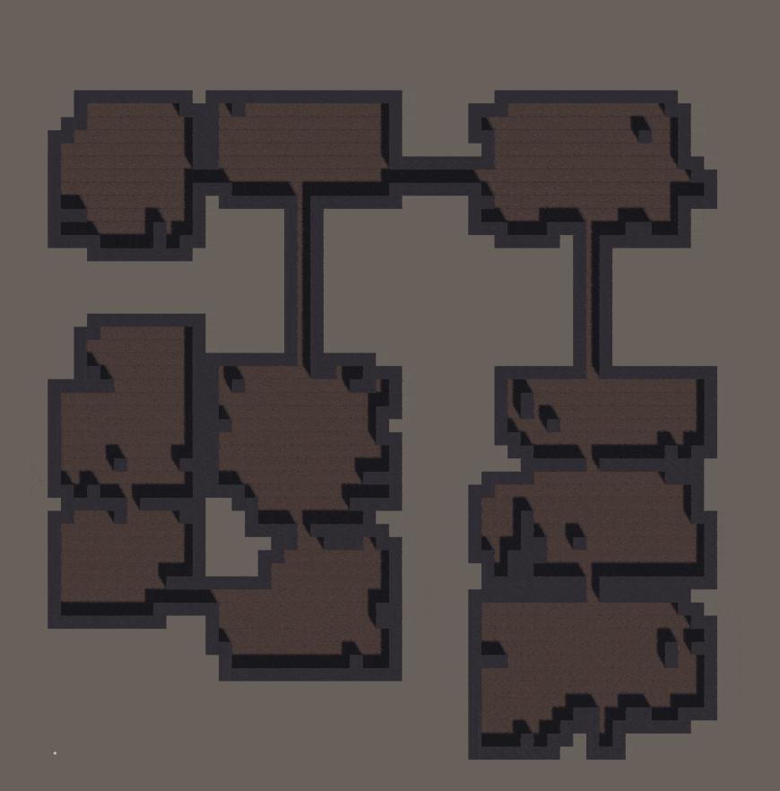

**The University of Melbourne**
# COMP30019 - Graphics and Interaction

## Teamwork plan/summary

<!-- [[StartTeamworkPlan]] PLEASE LEAVE THIS LINE UNTOUCHED -->

<!-- Fill this section by Milestone 1 (see specification for details) -->

**Sandeepa:**
* Animations
* Assets
* Items
* Sound (sfx, music, etc)
* Instruction Page

**Raziel:**
* Dungeon generation (Procedural)
* Shaders
* Distance Fog
* Modeling stair asset + material
* Set transparency of walls between player and camera
* Randomise spawn location for player + enemies + collectables
* Custom tiles (floor and wall)

**Anthony:**
* Entities Monster / player / other
* Particle System (Projectile)
* Controls
* Main Menu

<!-- [[EndTeamworkPlan]] PLEASE LEAVE THIS LINE UNTOUCHED -->

## Final report

### Table of contents
* [Game Summary](#game-summary)
* [Technologies](#technologies)
* [Instructions](#instructions)
* [Procedural Generation](#pricedural-generation)
* [Custom Shaders](#shaders)
* [Particle System](#particle-system)
* [Assets](#Assets)
* [Gameplay Design Decisions](#gameplay-design-decisions)
* [Player Feedback](#player-feedback)
* [Changes Based on Player Feedback](#Changes-Based-on-Player-Feedback)
* [References](#references)

### Game Summary

Escape the dungeon is a top-down rogue like shooter set in a world where you trapped inside a dungeon with no choice but fight your way out to escape. The dungeon holds a myriad of floors which require you to both fight and avoid monsters. In your quest to escaping the dungeon, there will be resources scattered throughout the dungeon designed to help you and once again make you strong enough to fight your enemies. Keep a look out for enemies and beware the dungeon will get harder as you get closer to escaping. Good Luck!

### How to play the game

The main menu has 4 selectable options, play, options, instructions, and quit. Upon selecting play, the user will be loaded into a procedurally generated dungeon. The user will see a player in a top down view in which they can control the player using wasd and control the direction the player is looking at  using the mouse. Additionally in order to shoot, the user can click the left mouse button. By pressing the ESC button you can return to the main menu at anytime. In the options menu, there is a slider to adjust the master volume of the game. In addition, there is an instruction menu explaining the controls and rules of the game. 


### Gameplay Design decisions

Each player and enemy had a controller and a health. For the player we used a rigidbody to allow the player to move and collide with walls. Whilst for the enemy at first we also used a rigidbody however this caused unwanted behaviour when colliding with the player therefore the enemy’s rigidbody was removed and instead has a collider to collide with the projectile.The enemies also move towards the player and when within a certain distance they will leap into an attack and return to its starting position. We then realised that we were unable to hit an enemy close to us such as an attacking wolf as the projectile only checked for collisions after it was instantiated. Therefore during the start frame update, we added a check to see if there were any initial collisions. 

### Assets
All of the objects, entities and textures were from the unity store, except for the projectile. 

### Technologies

Project is created with:
* Unity 2022.1.9f1 
* Blender 3.3.1
* Photoshop 2022
* [NoiseMaker](http://kitfox.com/projects/perlinNoiseMaker/)
* paint.net 4.3.12

### Instructions

Instructions for playing the game can be found by clicking on the Instructions Button on the Main Menu.

More detailed instructions can be found below:

* Movement: Move your character with either WASD or the Arrow Keys. Control your character's facing direction with the mouse.
* Shooting: Left click to shoot.
* Goal: Your goal is to escape the dungeon. You start in the deepest part of the Dungeon. Fight the monsters that attack you and find the staircase that will lead you to a  higher floor, and eventually the exit.
* Pickups: There will be health packs scattered throughout dungeon which will help you recover your health in times of need.
* Enemies: Enemies will seek you out and chase after you, and attack you if close. They can be killed by shooting them.
* Health: Your health can be found on the bottom left of the screen. If your health reaches zero, its game over.
* Levels: Each dungeon starts at the lowest level, indicated on the top left of the screen.
* Exit the Game: You can press `Esc` to exit to the Main Menu while playing, and Quit while on either the Main or End Menu to exit the program.

#### How to Play the Game

The main menu has 4 selectable options, play, options, instructions, and quit. Upon selecting play, the user will be loaded into a procedurally generated dungeon. The user will see a player in a top down view in which they can control the player using wasd and control the direction the player is looking at  using the mouse. Additionally in order to shoot, the user can click the left mouse button. By pressing the ESC button you can return to the main menu at anytime. In the options menu, there is a slider to adjust the master volume of the game. In addition, there is an instruction menu explaining the controls and rules of the game. 

### Procedural Generation

The dungeon layout is procedurally generated at runtime, and each time you change level.
#### Some Examples
<p allign="left">
  
</p>

The dungeon is intitialised onto a tilemap using Unity's built in tilemap features.
Custom tiles ([FloorTile](Assets/Prefabs/FloorTile.asset), [WallSimple](Assets/Prefabs/Walls/WallSimple.asset)) were used to place 3D prefabs onto a 2D tilemap

The intention of this level generation is to create interesting and replayable levels that pose a navigation challenge to the player each time they play.
The process for generating the level is as follows:

1. [Binary Space Partitioning](#binary-space-partitioning)
2. [Generate Rooms](#rooms)
3. [Join rooms with corridors](#corridors)
4. [Add walls](#walls)

#### Binary Space Partitioning

Partition the level space into rectangular sub-sections using the [binary space partition algorithm](Assets/Scripts/Dungeon/ProceduralGenerationAlgorithms.cs).
Define minimum width and height, as well as a scalar multiplier to bound max size in a [data asset](Assets/Scripts/Data/RoomsFirstDungeonData),
that is used by the [RoomsFirstDungeonGenerator](Assets\Scripts\Dungeon\RoomFirstDungeonGenerator.cs).
Using a standard binary space partitioning algorith, break the space up into a set of rectangles which will each have a room originating from them.

This algorithm is a natural choice to divide a 2D surface into rectangles of various sizes, and was not modified much from a standard implementation.

#### Rooms

Generate rooms using either a random walk algorithm or simply filling a rectangle defined by the room space (from the binary space partitioning) minus the offset from the loaded RoomsFirstDungeonData asset.
For the random walk room generation, use a modified random walk algorithm that bounds the potential positions of the walk. Set the bounds to the room space minus the offset and generate a room using parameters from a [data asset](Assets/Scripts/Data/SimpleRandomWalkDungeonData).

Using a random walk algorith to create rooms generates generally well formed rooms (with good parameters), but introduces enough varience to the shapes to make the rooms
not seem uniform or boring. Using a modified bounded version of the random walk algorithm just ensures that the dimesions of the room are restricted to the bounding box, 
allowing for seperation of rooms and a more dungeon-like structure.

#### Corridors

Once the rooms are generated, generate corridors from the current room center to the closest room center, removing each room center from consideration once connected to.
Corridors are generated with a basic pathfinding algorithm that travels in the z-axis until it reaches the destination z-value, then travels in the x axis until it reaches 
the destination x-value.

```c#
  ...
  // Chose random room center to start with
  var currentRoomCenter = roomCenters[Random.Range(0, roomCenters.Count)];
  // Remove starting room center
  roomCenters.Remove(currentRoomCenter);
  // While not all room centers are connected
  while (roomCenters.Count>0){
    // Find the closest room center not yet visited
    Vector3Int closestPoint = FindClosestPointTo(currentRoomCenter, roomCenters);
    // Remove newly visited room center
    roomCenters.Remove(closestPoint);
    // Generate the corridor
    HashSet<Vector3Int> newCorridor = CreateCorridor(currentRoomCenter, closestPoint);
    currentRoomCenter = closestPoint;
    // Add new corridor to set of existing corridors
    corridors.UnionWith(newCorridor);
  }
  ...
```

The corridor algorithm is very basic and can be improved both by more varied pathfinding and by using a (modified) minimum spanning tree generated from a graph of the room centers. This more complicated implementation was not used as the behaviour of the simpler algorithms were deemed sufficient for the structure of the game, and performance improvements were not relevent for the size of the dungeon being generated.

#### Walls

Once all floor positions are generated, walls are fitted to the outside borders of all floors.
The algorithm to do this is esentially brute force by iterating through all floor positions and checking all neighbours to see if they're empty. For the scale of the dungeons being generated, this does not pose a performance concern, however it would be necessary to improve the algorithm if larger dungeons were needed.

The wall tiles used were also designed for simplicity. A more complex implementation was considered with varied tiles depending on orientation and surroundings, but was decided against due to complexity constraints with finishing the game in time.

### Shaders

Two custom shaders were designed for the game to enhance the game's visuals and provide contextual information to the player.

Both shaders are based off the Unity Standard-Surface-Shader skeleton, with specific behaviour implemented for the desired results.

#### [Glimmer.shader](Assets/Materials/Glimmer.shader)

The glimmer shader was designed with the level exit in mind.
The shader provides a glimmering golden effect that modulates the material's color and emmission, and creates a metallic appearance.
The shader also applies a noise map to change the intensity of each pixel over time, to proved an ever-changing shimmering look.

The purpose of this shader adder to the level exit is to make the exit stand out from the rest of the level and be desirable for the player to investigate.

#### [Glow.shader](Assets/Materials/Glow.shader)

The glow shader was designed to provide a pulsing glowing effect to objects in the game.
The shader provides a varied emission over time, which is translated into a glow using Unity's Post-Processing functionality
The shader also applies a gradient map to smoothly vary the glow over each pixel, and make the pulsing effect stand out more.

This shader is applied to the health pick-ups to make them pulse enticingly and attract attention, as well as stand out in the level.

### Particle System
The [projectile's](Assets/Prefabs/Projectile8.prefab) mesh was modelled in blender while the texture was created in photoshop and imported into blender. The projectile includes a particle system to create the effect of a magic projectile. There is Emission, Color over lifetime and rotation over lifetime, to simulate the effects of a realistic magic projectile. The color over lifetime alternates between two shades of yellow so as to not make the projectile look repetitive. On top of this the audio further adds to the immersive experience.

### Assets

Most of the objects, entities and textures were from the unity store. The custom models used are the projectile and the [staircase](Assets/Prefabs/stair.fbx), both modeled in blender. A number of gradient textures and a noise map were also created. A number of sprites were used, some from the unity store and others from license-free images found online.

### Gameplay Design Decisions

Each player and enemy had a controller and a health. For the player we used a rigidbody to allow the player to move and collide with walls. Whilst for the enemy at first we also used a rigidbody however this caused unwanted behaviour when colliding with the player therefore the enemy's rigidbody was removed and instead has a collider to collide with the projectile.The enemies also move towards the player and when within a certain distance they will leap into an attack and return to its starting position. We then realised that we were unable to hit an enemy close to us such as an attacking wolf as the projectile only checked for collisions after it was instantiated. Therefore during the start frame update, we added a check to see if there were any initial collisions. 

### Player Feedback

In evaluating our game, we had 5 participants; a 14 year old female, 17 year old female, a 20 year old male, a 25 year male and a 52 year old female. We tried to get participants with a wide range with no restriction on age and gender as we will be able to get a variety of different ideas and input.

#### Post-Task Walkthrough

We utilised the post-task walkthrough in order to allow the participants to fully immerse themselves in the game whilst not disturbing them. In addition, we also used the cooperative evaluation observational methods to get accurate feedback in live time to make sure nothing important was missed. We decided to record the participants feedback and write down their replies to accurately store the data. After completing their task, we had the participants complete a survey with fixed questions as the Querying technique.

#### Fixed Questions Survey

The participants were asked to play the game for 10-15 minutes, and immediately afterwards were asked the following questions. Answers were given on a scaling score of 
1-5, with 1 indicating a low score and 5 indicating a high score.

The questions, and the average result of the 5 participants is recorded below:
  1.  How distracting were the sound effects in this video game?  2.2  
  2.  Was the player movement too slow?                           1.4
  3.  How exciting was the game?                                  3.4  
  4.  How difficult was the game?                                 2.8  
  5.  How appealing is the graphics?                              3.2  
  6.  How often would you play this game?                         2.4  
  7.  Do you think the map size is too big?                       3.2  
  8.  How was the action combat experience?                       4.0   
  9.  Are the mobs too weak?                                      2.6  
  10.  Was the game tiresome?                                     1.8  
  11.  Was the game challenging?                                  3.0

In general, players were fairly neutral on this fixed question survey. 
Its apparent most players felt the player characteer movement speed was appropriate, and that the action combat experience was enjoyable, and that the game waas not tiresome. Some players also felt that the map size was too big, despite not having issues with the player characters speed.
While this fixed questioning gave an overview of player sentiment, it did not provide particularly specific data.

#### Cooperative Evaluation

In addition to fixed questioning, we performed cooperative evaluation by encouraging palyeers to voice their opinion and feelings while playing, and we recorded these observations. Through this method we learnt that many of our participants felt that it was hard to hit the enemy, hard to see where to navigate through the map, that the enemy pathfinding sometimes resulted in enemies getting lost or stuck, and that having no clear end level felt frustrating. 

We also learned that players felt the combat was exciting, but that they enjoyed running away from the enemies more than actually engaging them in combat, perhaps due to responsiveness issues with bullet-enemy collision. Players also expressed excitement at finding health packs and finding the stairs to progress to the next level.

### Changes Based on Player Feedback

By reviewing areas where the majority of play testers were dissatisfied, we decided to change certain aspects of the game as shown below.
  
1. Improved contrast between walls and floor to improve visibility and therefore navigation ability
2. Increased camera angle to improve visibility and therefore navigation ability - (0, 8, -10) -> (0, 10, -8)  
3. Improved enemy pathfinding speed - Changed update refresh rate from 0.25 to 0.10  
4. Changed font of Game Title to make it stand out from the Menu options
5. Improved ingame instructions to minimise player confusion
6. Added end game screen and made the level counter count down to indicate how many levels are remaining
7. Increase enemy hitbox size to improve attack responsiveness 

### References

["Unity 5 - Game Effects VFX - Fireball Spell / Projectile" by Gabriel Aguiar Prod](https://www.youtube.com/watch?v=-P09r-ALN38)

["Building a 3D Top-Down Shooter w/ Unity #2 - Shooting Projectiles" by Ajackster](https://www.youtube.com/watch?v=89h859pFglc)

["Top Down Shooter: Unity tutorial series (01)" by Sebastian Lague](https://www.youtube.com/watch?v=pSN2x3dPgYw)

["Unity Create a Game Series (Introduction)" by Sebastian Lague](https://www.youtube.com/watch?v=SviIeTt2_Lc)

["Procedural Dungeon Generation in Unity 2d tutorial" by Sunny Valley Studios](https://www.youtube.com/playlist?list=PLcRSafycjWFenI87z7uZHFv6cUG2Tzu9v)

["3D Tilemap in Unity" by Vector Bread](https://www.youtube.com/watch?v=ulFc6p3hQzQ)

[Vertex Shader Tutorial for Unity by Federico Bellucci](https://www.febucci.com/2018/10/vertex-shader/)